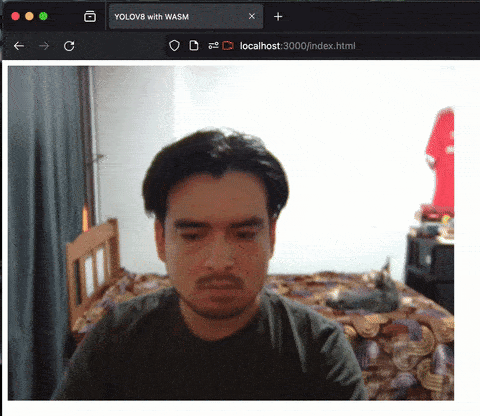

# YOLOV8 Drivesafe Model with WASM JS Worker

<p align="center">
  
</p>

## Instrutions

1. To install dependencies:

```bash
   bun install
```

2. Run bun server:

```bash
bun run index.tsx
```

3. Navigate to:
   http://localhost:3000/index.html
